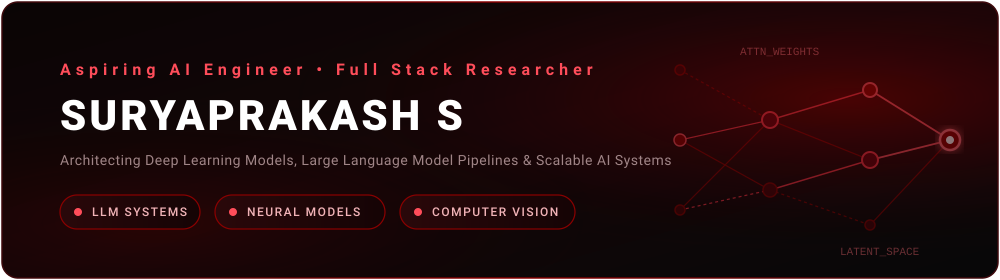

<!-- Cover Card -->

  

 

<!-- LLMs, AI & Models Visuals -->
## LLMs, AI &amp; Foundation Models

  
  &nbsp;
  
  &nbsp;
  
  &nbsp;
  
  &nbsp;
  

  
  &nbsp;
  
  &nbsp;
  
  &nbsp;
  
  &nbsp;
  

 

---

## GitHub Streaks &amp; Activity

  

 

  <h3>Contribution Timeline</h3>
  

---

## Connect with Me

  

    
    &nbsp;
    
  

